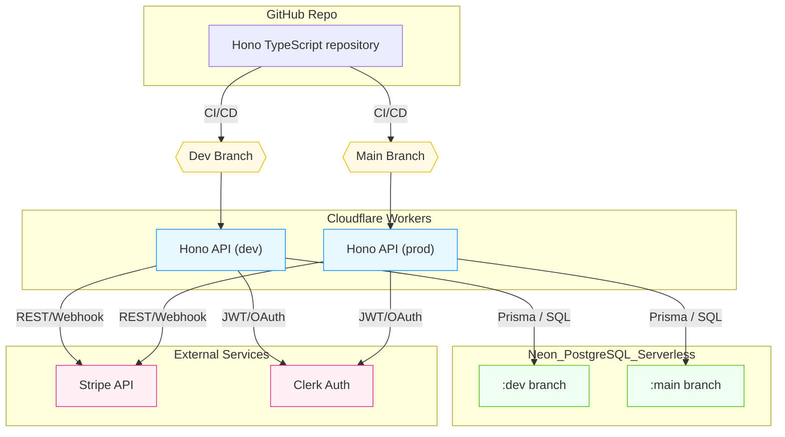

```mermaid
flowchart TD
  subgraph GitHub Repo
      SRC["Hono TypeScript repository"]
  end

  DEV{{"Dev Branch"}}:::branch
  PROD{{"Main Branch"}}:::branch

  SRC -->|CI/CD| DEV & PROD

  subgraph Cloudflare Workers
      WORKER_DEV["Hono API (dev)"]:::worker
      WORKER_PROD["Hono API (prod)"]:::worker
  end

  DEV --> WORKER_DEV
  PROD --> WORKER_PROD

  subgraph Neon_PostgreSQL_Serverless
      NEON_DEV[":dev branch"]:::db
      NEON_PROD[":main branch"]:::db
  end

  WORKER_DEV -- "Prisma / SQL" --> NEON_DEV
  WORKER_PROD -- "Prisma / SQL" --> NEON_PROD

  subgraph External Services
      STRIPE["Stripe API"]:::svc
      CLERK["Clerk Auth"]:::svc
  end

  WORKER_DEV -- REST/Webhook --> STRIPE
  WORKER_PROD -- REST/Webhook --> STRIPE
  WORKER_DEV -- JWT/OAuth --> CLERK
  WORKER_PROD -- JWT/OAuth --> CLERK

  classDef branch fill:#fffae6,stroke:#e8c000,stroke-width:1px;
  classDef worker fill:#e6f7ff,stroke:#1890ff,stroke-width:1px;
  classDef db fill:#f0fff4,stroke:#52c41a,stroke-width:1px;
  classDef svc fill:#fff0f6,stroke:#d92d8b,stroke-width:1px;
```
